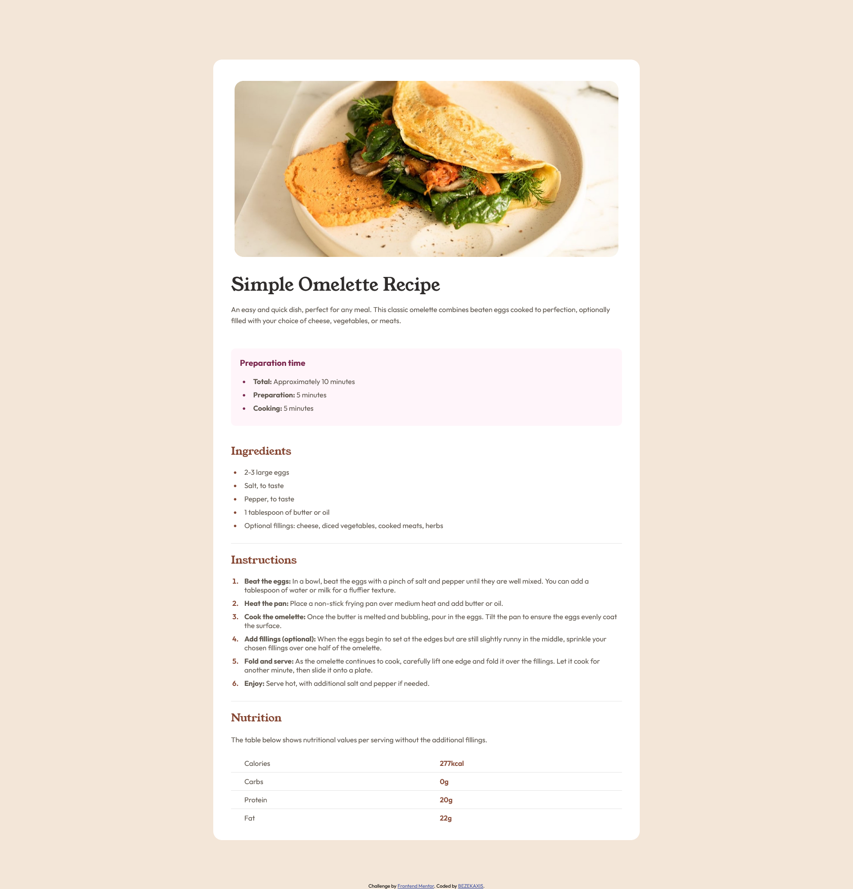

This is a solution to the [Recipe page challenge on Frontend Mentor](https://www.frontendmentor.io/challenges/recipe-page-KiTsR8QQKm).

## Overview

### Screenshot

### Links

- Solution URL: [Add solution URL here](https://your-solution-url.com)

## My process

### Built with

- Semantic HTML5 markup
- CSS custom properties

### What I learned

I learned some css tags and semantic html. And helped me reinforce what I already knew

### Continued development

I want mastery responsive layouts, it was fun working with it.

### Useful resources

i searched in many blogs looking for techniques that can be used
